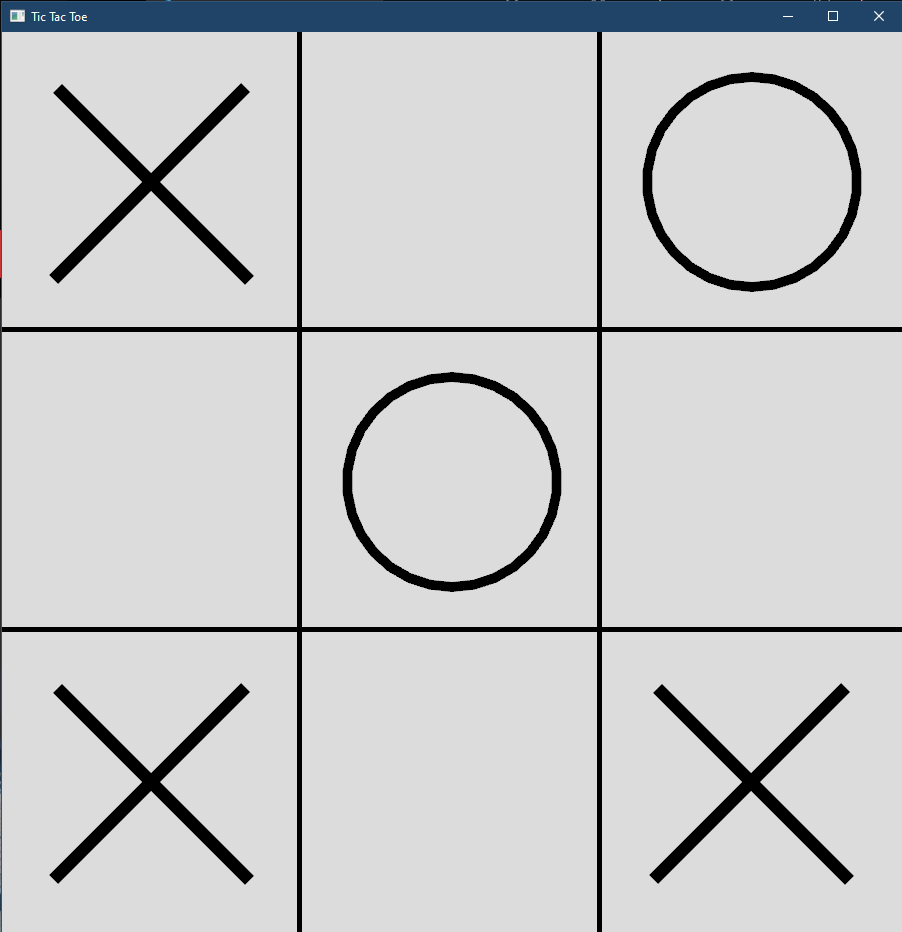
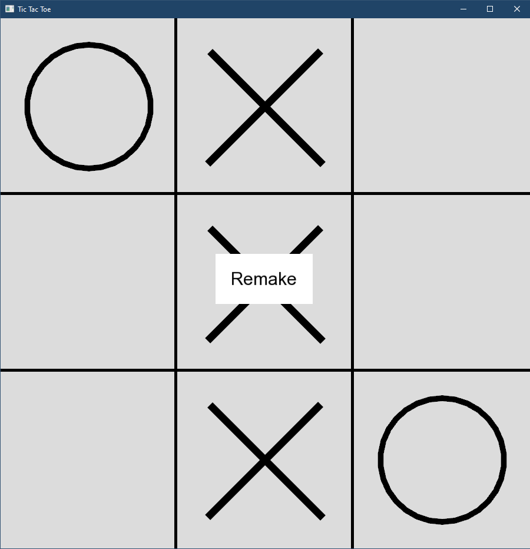

# Tic Tac Toe
Tic Tac Toe is a classic game where two players take turns marking Xs and Os on a 3x3 grid. The objective is to be the first player to get three of their symbols in a row, either horizontally, vertically, or diagonally.

For this project, we will be creating a Tic Tac Toe game using the SFML library in C++. The game will have the following operations:

* Operation 1: Initialize the game board
* Operation 2: Play the game by taking turns and checking for a win or a tie

## Demo
- Game Play
  
   
   
- Restart
  
   

## Design
https://github.com/hanbintan2003/TicTacToeSFML/blob/main/design.txt

## Features

- A user-friendly interface with clear instructions and buttons to restart the game or quit.
